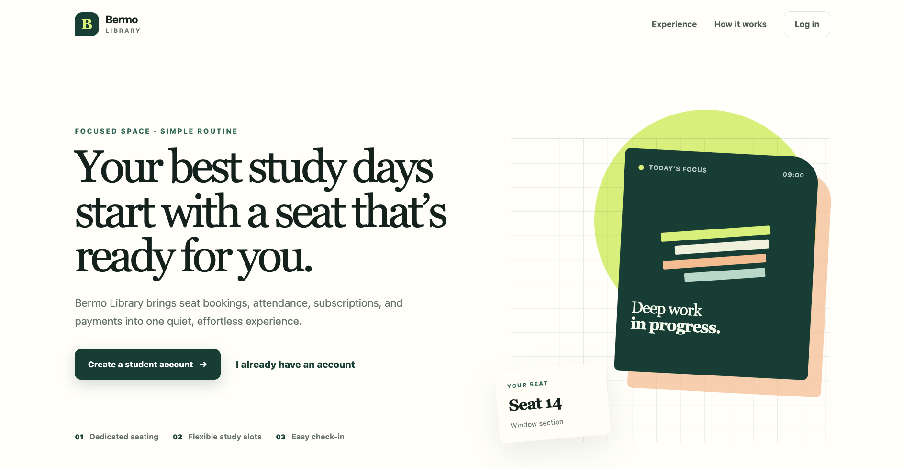
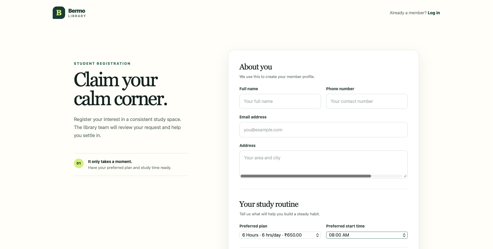
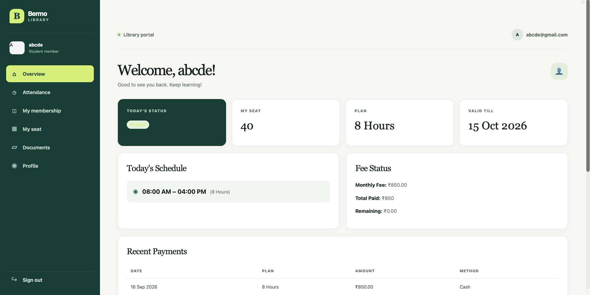
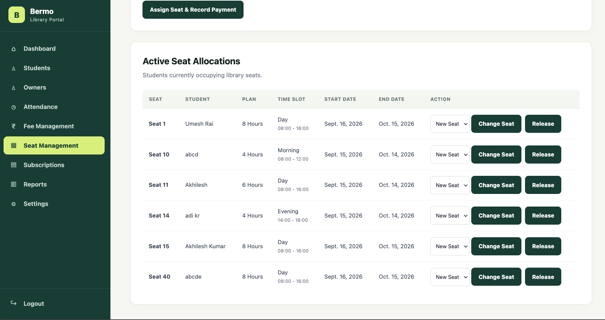
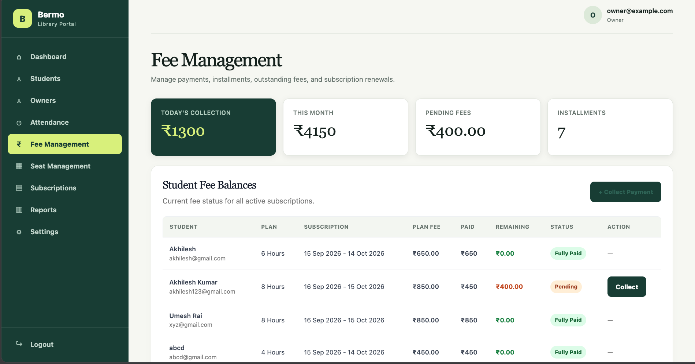
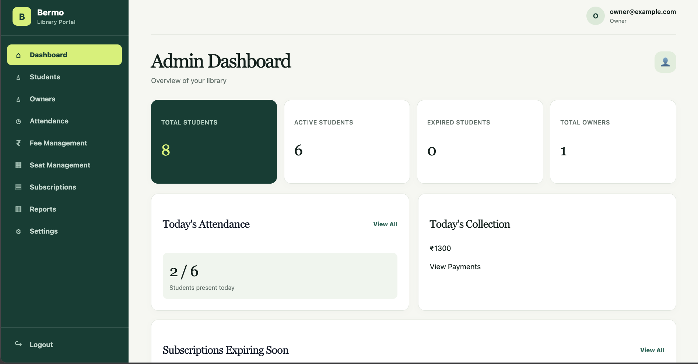

# Bermo Library Management System

A private library management system built with **Django** to manage
students, library seats, subscriptions, attendance, fees, payments, and
administrative operations from a single platform.

## Project Screenshots

## Screenshots

### Home Page




#### Student Signup


###  Student Dashboard



###  Seat Management



###  Fee Management



###  Admin Dashboard



### Attendance Page


### Active Subscriptions


### Students page for Admin


### Fee Management


##  Features

### Student Features

-   Student registration and login
-   Student dashboard
-   Profile management
-   Profile photo and document upload
-   Preferred subscription plan and time-slot selection
-   Subscription and seat information
-   Attendance check-in/check-out and history
-   Fee and payment information
-   Membership status

### Admin & Owner Features

-   Admin and owner dashboards
-   Student management
-   Student approval and rejection
-   Student unregistration
-   Owner management
-   Subscription management
-   Seat assignment, release, and change
-   Attendance management
-   Fee and payment management
-   Installment payments
-   Reports
-   Library settings
-   Audit logging

## Seat Management

Students do not choose a seat during registration. After an application
is reviewed and approved, an available seat can be assigned by the
library administration.

The system supports: - Available and occupied seat tracking - Seat
assignment - Seat changes - Seat release - Seat allocation history -
Prevention of conflicting active allocations

## Subscription Plans

  Plan         Hours/Day   Monthly Fee
  ---------- ----------- -------------
  4 Hours              4          ₹450
  6 Hours              6          ₹650
  8 Hours              8          ₹850
  10 Hours            10        ₹1,050
  12 Hours            12        ₹1,100

Plans currently use a 30-day subscription period.

## Fee & Payment Management

Payments are recorded against subscriptions and support manual
installments.

Example:

``` text
8-hour plan = ₹850
First payment = ₹300
Remaining = ₹550
Later payment = ₹550
```

Installment payments do not add extra subscription days; they are
payment records against the subscription.

## Attendance

Attendance records include: - Date - Check-in time - Check-out time -
Seat - Status - Total hours

Students can view their attendance history, while authorized management
users can review attendance records.

## User Roles

### ADMIN

Full management access, including students, owners, seats,
subscriptions, fees, payments, attendance, reports, settings, and audit
logs.

### OWNER

Access to day-to-day library management operations according to the
permissions implemented by the application.

### STUDENT

Access to their own dashboard, profile, documents, subscription, seat
information, attendance, and payment information.

## Student Registration Workflow

``` text
Student Registration
        ↓
Student Profile Created
        ↓
Status = PENDING
        ↓
Student Selects Plan & Preferred Time Slot
        ↓
Admin/Owner Reviews Application
        ↓
Application Approved
        ↓
Available Seat Assigned
        ↓
Subscription Created
        ↓
Student Status = APPROVED
        ↓
Attendance / Payments / Library Usage
```

Rejected applications can store a rejection reason. When a subscription
ends, a student can be unregistered while historical records are
preserved.

## Project Structure

``` text
library_management_system/
│
├── manage.py
├── requirements.txt
├── pyproject.toml
│
├── accounts/
├── students/
├── library/
├── attendance/
├── payments/
├── management/
│
├── templates/
├── static/
│   └── css/
│       └── main.css
├── media/
│
└── library_management_system/
    ├── settings.py
    ├── urls.py
    ├── wsgi.py
    └── asgi.py
```

## Tech Stack

-   **Python**
-   **Django 5.2**
-   **Django Templates**
-   **HTML5 / CSS3**
-   **Django ORM**
-   **SQLite** for local development
-   **PostgreSQL / Neon** for deployment
-   **Vercel** for deployment

## Django Apps

  App            Responsibility
  -------------- --------------------------------------------------
  `accounts`     Users, roles, authentication, audit logs
  `students`     Student profiles and student functionality
  `library`      Library, seats, plans, time slots, subscriptions
  `attendance`   Attendance records
  `payments`     Payments and installment allocation
  `management`   Admin/owner dashboard and operations

## Core Models

The application contains models for:

-   `User`
-   `AuditLog`
-   `StudentProfile`
-   `Library`
-   `Seat`
-   `SubscriptionPlan`
-   `TimeSlot`
-   `Subscription`
-   `SeatAllocation`
-   `Payment`
-   `PaymentAllocation`
-   `Attendance`

## Local Development

### 1. Clone the repository

``` bash
git clone https://github.com/umeshrai01/library_management_system
cd library_management_system
```

### 2. Create and activate a virtual environment

macOS/Linux:

``` bash
python3 -m venv .venv
source .venv/bin/activate
```

Windows:

``` bash
python -m venv .venv
.venv\Scripts\activate
```

### 3. Install dependencies

``` bash
pip install -r requirements.txt
```

### 4. Apply migrations

``` bash
python manage.py migrate
```

### 5. Create an administrator

``` bash
python manage.py createsuperuser
```

### 6. Start the server

``` bash
python manage.py runserver
```

Open:

``` text
http://127.0.0.1:8000/
```

## Static Files

The main stylesheet is:

``` text
static/css/main.css
```

To collect static files:

``` bash
python manage.py collectstatic --noinput
```

## Database Configuration

SQLite is used when a PostgreSQL `DATABASE_URL` is not provided.

Production can use PostgreSQL through:

``` text
DATABASE_URL=<your-postgresql-connection-string>
```

Never commit database credentials to the repository.

## Environment Variables

Typical production variables include:

``` text
DJANGO_SECRET_KEY
DEBUG
DATABASE_URL
CSRF_TRUSTED_ORIGINS
```

Keep real values in the deployment platform's environment-variable
settings.

## Deployment

The project is prepared for deployment using Vercel and Neon PostgreSQL.

Useful checks:

``` bash
python manage.py check
python manage.py check --deploy
python manage.py collectstatic --noinput
```

Preview deployment:

``` bash
vercel
```

Production deployment:

``` bash
vercel --prod
```

## Production Considerations

### Database

Local SQLite and production PostgreSQL are separate databases. Existing
local data should be migrated deliberately before using the production
database.

### Media Files

Student photos and uploaded identity documents are user-generated files
and should use persistent external storage in production. Identity
documents such as Aadhaar should be kept private and should not be
publicly accessible.

### Secrets and Private Data

Do not commit:

``` text
.env
.env.*
db.sqlite3
media/
.venv/
staticfiles/
```

Also make sure student information, uploaded documents, credentials, and
other private data are never pushed to a public repository.

## Useful Commands

``` bash
python manage.py check
python manage.py check --deploy
python manage.py makemigrations
python manage.py migrate
python manage.py collectstatic --noinput
python manage.py createsuperuser
python manage.py runserver
```

## Future Improvements

-   Online payment integration
-   Automated payment receipts
-   WhatsApp/SMS notifications
-   Email notifications
-   Subscription-expiry notifications
-   Advanced attendance reports
-   Visual seat map
-   Revenue reports
-   Backup and restore
-   Secure cloud media storage
-   Improved mobile responsiveness
-   More granular role-based permissions

## Author

**Umesh Kumar Rai**

Built as a Django-based management platform for a private study library.

## License

This project is intended for private library-management use.

Before publishing the repository publicly, verify that it contains no
student information, Aadhaar documents, database files, credentials,
environment variables, or other private data.
